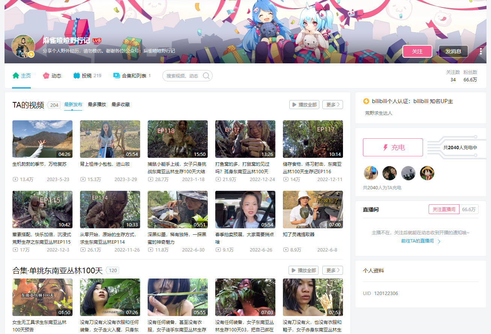

# 陈德成作品集

—— 你看到的是一个正在成长的德成。（内容持续不定期更新中）

本页面主要用来分享德成的作品以及德成认为的高价值内容。

如果你是通过<https://decheng.xyz>网址访问的，点击左下角的三横图标，可以查看目录并很方便地跳转。

目前的内容分6部分：
- 写小说
> 不定期更新，暂不公开
- 德成的现世价值观楷模
> 主要为了罗列德成对世界的认知，以及学习对象，这里面也许就有你也喜欢的人，也许你还不够了解他们
- 业余上王者方法论
> 王者荣耀是受众非常广的一款竞技游戏，几乎继承了桌面端的LOL(英雄联盟），可以说是90后共同的回忆。王者荣耀也正在成为80后、90后、00后、甚至10后们的共同话题。但不管是哪个年龄段，玩游戏玩得好的总是占少数，懂方法论的就更少了，这部分内容主要就是德成用了32天从青铜一路单排到王者的方法论分享。
- 德成以前的选择
> 这部分可以帮助你了解德成以前的一些经历。
- 区块链与比特币
> 很多人听说过比特币，但大部分都仅仅是听说了价格涨得很疯狂，然后零碎地从各种媒体模糊地了解到比特币和“泡沫”“骗局”等词的关联，然后自然地认为“只要我不去碰就和我没有任何关系”，但我想提醒你的是，比特币绝对和你有关系，其实和地球上所有人都有关系，因为所有人都要跟所谓的“钱”打交道，为什么呢？逐字阅读德成分享的内容吧，你一定会感谢德成的。
- 陈德成语录
主要分享德成想通的一些道理
-----

## 写小说

不定期更新，暂不公开

## 德成的现世价值观楷模

什么是“现世”？  

指目前在世且有公开活动，不包括已经逝去的伟人，比如毛主席，比如孔子。

为什么要“现世”？  

生活在同一个时代里，同一片天空下，同一个社会格局中，在信息时代，可以在了解TA过去的成长历史的同时，实时了解楷模的一些现状，某种意义上来说，可以和楷模一起共同成长。如果是非现世，我最崇敬的楷模应该是钱学森。

什么是楷模？  

可以指在某方面的偶像，也可以指目前了解到的在各个领域追求到极致，达到世界顶级水平的人。如果你发现有高于或并列于德成发现的这个人水平的人，欢迎知会德成，一起交流，德成微信号：CDCKQL

下面是德成在“人与自然”、“人与社会”、“人与艺术”、“人与宇宙”四个方面发现的“现世价值观楷模”

+ 人与自然：麻雀喳喳  

一个人在丛林实现：砖木取火、纺织制衣、石器制作、陶器制作、铁器制作，等惊人的技能。  

一个有现代社会工作和生活的女性，同时拥有回归原始丛林野外生存100天的能力。  

传送门：Bilibili [@麻雀喳喳野行记](https://space.bilibili.com/120122306?spm_id_from=333.337.0.0)


+ 人与社会：[谭乔](https://space.bilibili.com/330415548?spm_id_from=333.337.0.0)，[李笑来](https://lixiaolai.com)

明白人，博学多才。

以前还有“丁元英” ，2023年把他去除了，对《遥远的救世主》更多视角审视后，对丁元英无感了。

+ 人与艺术：

—— 华晨宇  

花花是一个有争议的歌手。他以超凡的艺术表达能力，抚慰人们的灵魂，如果你不赞同，很正常。就像一个小孩，兴奋地表达开心或悲伤时，发出的声音是来自生命的律动，至于别人听感是不是足够舒服，这是次要的，当然随着花花年龄的增长，他唱歌的“动听度”在逐年上升。他的原创不把传唱度和“动听度”放在首位，他的改编创新大胆。

传送门：[华晨宇的小海翻宇航员](https://space.bilibili.com/67199308?spm_id_from=333.337.0.0)；YouTube 或 Bilibili 搜 “reaction Hua chenyu”


+ 人与宇宙：

刘慈欣

中国航天（[国家航天局](https://www.cnsa.gov.cn/index.html)）

之前是伊隆·马斯克，理由是：用实际行动和成绩推动新能源的发展，创办私企降低航天成本，但后来对马斯克更多更深入的了解后，对他无感了。

2023年更新为刘慈欣，主要喜欢他的科幻作品，三体。

2023年9月，如果不要求现世，应该加上钱学森，最近才得知，马斯克是钱学森的粉丝。


## 业余上王者方法论

2020年10月到11月，德成为了释放压力，玩起了王者荣耀，历时32天，全程单排，从倔强青铜段位玩到了最强王者。

> 这是一个新号，开始时昵称叫“欠揍的好人”，现在改成“decheng.xyz”了

于是总结了一些方法论，分享给久玩不上王者的朋友，你只要能做到我说的这些点，胜率就能大于50%，玩到王者段位。

* 稳定的环境
> - 不受打扰的环境
> - 良好的网络环境
* 先打两把匹配预热，再排位
* 心情愉快放松，体验不到快乐时，就打不好
* 不要只为上分的心态打
* 大逆风要尽量避免交战，更不要总想着抓人
* 逆风要多带线发育，收线推完塔就跑。
* 永远不要跟队友对骂
* 死了不要怪队友
* 尽量使用简单的熟练的英雄
> 比如我主要用庄周和亚瑟，就到了星耀1。道理和投资领域的定投策略类似，招数极简，只有一招一式，反而胜率更大。

如果以上的各条都记不住也做不到，那么一定理解并做到下面这条：
* 王者荣耀其实和小孩打架是一样一样的
> **很大程度都是比发育**，所以，“拼命搞钱发育”才是正事。

真正的王者根本没时间也根本不会去责怪队友打得不好或者发挥得不好，遇到骂自己的队友也不会还嘴。他们只关注自己的发育，拼命地发育，经常以一己之力把节奏往好的方向带。

德成只要遇到那种骂队友的，或者互喷的，结束后通通把他们拉黑，以后再也不想跟他们匹配成队友。

只要你养成这个习惯。那么你以后遇到这种人的概率就会变得更小，然后你就会经常打着打着发现，对面怎么这么菜。其实就是对面有人在互喷，骂起来了。甚至还有送人头的，卖装备只剩下一双鞋的。

-----

我的手机浏览器一直会保留我经常要用到的一些网站，今天，打开浏览器看到了之前保留的 <https://decheng.xyz>，浏览了之前写的《业余上王者秘密心法》，字数不多，只是一条一条的心得，但我看着看着，发现它们很像一本书的章节标题。这些心得其实只是我一些很强烈的想法总结，并没有写为什么会有这些心得，也就是还没有写WHY，如果每条心得都展开来，这不就是一本书嘛。

书名的大意应该是“打王者荣耀发现的王者之路”，或者“打王者荣耀上王者后发现的成功学”……

但我太懒了，不知道这书何时能写出来……
2020-12-15


-----

## 德成以前的选择

人生就是做选择题，选择了，认准了一件事，就要一直做下去，持续积累，才能把事真正做好。虽然毕业这近6年多以来，德成还从没有在一件事上持续地积累超过5年，但每件事基本都做到80分以上，然后被搁置，去做另一件同样很有意思的事。

然而真正要有所成就，必须做到100分，甚至120分，多出来的20分意思就是比百分百的好还要好20分。

所以接下来的5年，德成面临一些选择，并相应地在那个领域持续积累，先列出目前有的一些选择：

* 首先当然是我本科学的专业：测绘工程

> 德成认为往更好的深入是“地理信息”行业，更具体的方式是学习数据分析相关，或者考证，注册测绘师证书等……

* 然后是完全不一样的领域：绘画，CG，UI，这些基本成为了我的兴趣爱好，这个是艺术相关(必须砍掉一些，留一两个精进，那样才能做出好作品，我可是一个会成为艺术大师的男人)

* 再就是最近才开始涉足的：编程，写作，社群，直播……   目前都才刚刚开始，正在持续积累，有兴趣的朋友可以和德成一起共同成长，请关注微信公众号“德成的分享”，微信号：cdckql，视频号：德成的分享（开始取名“超能力教练”，后来改成和公众号同名)。
> 目前选择先打好基础，也就是写作，进一步具体，我选择写小说，也就是写故事，再进一步具体，先写明白我自己。

### 求学时(待补充)

上所谓的大学，高中毕业选专业，作为一个带有文艺气息的理科生，选了个专业叫“测绘工程”，为什么选这个呢，很大一部分因为里面带一个“绘”字。因为我喜欢写写画画。

### 工作时(待补充)

第一年在虎门二桥(现在竣工后叫南沙大桥)工地上，目前写过一篇与那段时间相关的文章，[看这里](https://w3c.group/c/1575814615988447)

……待续
–––––

2020年4-6月，微信视频号内测，德成玩了一段时间。
以下是德成在2020-04-25更新的视频号文案，分享一下
```
你好，我是超能力教练阿成。

以前我觉得还不错的一首歌，今天发现它有毒，就是五月天的你不是真正的快乐。

为什么说他有毒呢，你不是真正的快乐，它会让我反复想起我一些不快乐的瞬间，它一直在反复强调，你不是真正的快乐，然后我就沉浸在过去的不快乐中，我就真的不快乐了。

今天我发现一个秘密就是，其实每个人本来就可以非常的快乐，不管你的处境是什么你的环境是什么你遭遇了什么，只要你还活着，都不会影响你获得快乐的自由。

相信我，你可以通过自己的能量瞬间就变得很快乐，你不需要靠刷搞笑视频来获得快乐，你不需要其他外在的任何东西来使你快乐。快乐是每个人都拥有的潜力，它就是你的一种超能力，你可以凭空就获得快乐。

具体怎么做呢，很简单，下一次更新后就知道了。(这是“超能力教练”视频号一个视频的文案)
```

这一段写于2020-2-11，最近的疫情可能让你很闹心，德成在这方面没法直接提供有效帮助，但可以推荐给你一篇很棒的文章：[助人即助己](https://github.com/xiaolai/help-to-be-helped)，相信会帮到你。

这一段写于2020-2-14，世界运转，三大仪式

> + 吃 输入

>> * 信息：文字，图像，音，影音，来源某个人，听谁说话

> + 消化 处理 

>> * 吸收好的，去除不好的  

>> * 思考分析，发呆，奇思妙想，休息，睡觉

> + 生命力 输出创造

>> * 温饱的愉悦，身体成长

>> * 记录，写想法，图像，语音，视频

这段写于2020-3-1，闪念：记录自己使用互联网应用的一切数据，自己去记录，手动，一个一个抄下来。


## 区块链与比特币

比特币是区块链技术的代表应用，也算是一种资本主义的东西，可学习研究，但谨慎参与。

区块链这部分呢，德成是从2017年6月第一次听说，之后逐步深入了解的。

> * 推荐使用[水龙头APP](https://app.exinearn.com/invite/MXMYNX?source=link)获取免费的比特币


[](images/decheng-photo-out.png)

## 陈德成语录

+ 每天做一点有积累价值的事
