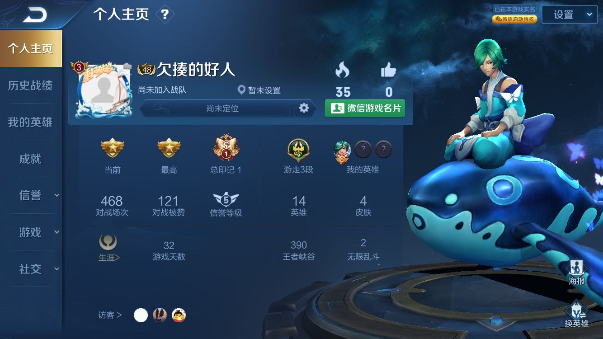

# 陈德成作品集

—— 你看到的是一个正在成长的德成。（内容持续不定期更新中）

2020年10月到11月，德成为了释放压力，玩起了王者荣耀，历时32天，全程单排，从倔强青铜段位玩到了最强王者。于是总结了一些心法，分享给久玩不上王者的朋友，你只要能做到我说的这些点，胜率就能大于50%，玩到王者段位。

> 这是一个新号，开始昵称叫“欠揍的好人”，现在改成“decheng.xyz”了
## 业余上王者秘密心法
* 稳定的环境
> - 不受打扰的环境
> - 良好的网络环境
* 先打两把匹配预热，再排位
* 心情愉快放松，体验不到快乐时，就打不好
* 不要只为上分的心态打
* 大逆风要尽量避免交战，更不要总想着抓人
* 逆风要多带线发育，收线推完塔就跑。
* 永远不要跟队友对骂
* 死了不要怪队友
* 尽量使用简单的熟练的英雄
> 比如我主要用庄周和亚瑟，就到了星耀1。道理和投资领域的定投策略类似，招数极简，只有一招一式，反而胜率更大。

最后一个核心总结
* 王者荣耀其实和小孩打架是一样一样的
> **很大程度都是比发育**，所以，拼命搞钱和发育才是正事。

–––––

2020年4-6月，微信视频号内测，德成玩了一段时间。
以下是德成在2020-04-25更新的视频号文案，分享一下
```
你好，我是超能力教练阿成。

以前我觉得还不错的一首歌，今天发现它有毒，就是五月天的你不是真正的快乐。

为什么说他有毒呢，你不是真正的快乐，它会让我反复想起我一些不快乐的瞬间，它一直在反复强调，你不是真正的快乐，然后我就沉浸在过去的不快乐中，我就真的不快乐了。

今天我发现一个秘密就是，其实每个人本来就可以非常的快乐，不管你的处境是什么你的环境是什么你遭遇了什么，只要你还活着，都不会影响你获得快乐的自由。

相信我，你可以通过自己的能量瞬间就变得很快乐，你不需要靠刷搞笑视频来获得快乐，你不需要其他外在的任何东西来使你快乐。快乐是每个人都拥有的潜力，它就是你的一种超能力，你可以凭空就获得快乐。

具体怎么做呢，很简单，下一次更新后就知道了。(这是“超能力教练”视频号一个视频的文案)
```

这一段写于2020-2-11，最近的疫情可能让你很闹心，德成在这方面没法直接提供有效帮助，但可以推荐给你一篇很棒的文章：[助人即助己](https://github.com/xiaolai/help-to-be-helped)，相信会帮到你。

这一段写于2020-2-14，世界运转，三大仪式

> + 吃 输入

>> * 信息：文字，图像，音，影音，来源某个人，听谁说话

> + 消化 处理 

>> * 吸收好的，去除不好的  

>> * 思考分析，发呆，奇思妙想，休息，睡觉

> + 生命力 输出创造

>> * 温饱的愉悦，身体成长

>> * 记录，写想法，图像，语音，视频

这段写于2020-3-1，闪念：记录自己使用互联网应用的一切数据，自己去记录，手动，一个一个抄下来。

-----

人生就是做选择题，选择了，认准了一件事，就要一直做下去，持续积累，才能把事真正做好。虽然毕业这近6年多以来，德成还从没有在一件事上持续地积累超过5年，但每件事基本都做到80分以上，然后被搁置，去做另一件自己觉得也很有意思的事。

然而真正要有所成就，必须做到100分，甚至120分，多出来的20分意思就是比百分百的好还要好20分。

所以接下来的5年，德成面临一些选择，并相应地在那个领域持续积累，先列出目前有的一些选择：

* 首先当然是我本科学的专业：测绘工程

> 德成认为往更好的深入是“地理信息”行业，更具体的方式是学习数据分析相关，或者考证，注册测绘师证书等……

* 然后是完全不一样的领域：绘画，CG，UI，这些基本成为了我的兴趣爱好，这个是艺术相关(必须砍掉一些，留一两个精进，那样才能做出好作品，我可是一个会成为艺术大师的男人)

* 再就是最近才开始涉足的：编程，写作，社群，直播……   目前都才刚刚开始，正在持续积累，有兴趣的朋友可以和德成一起共同成长，请关注微信公众号“德成的分享”，微信号：cdckql，视频号：超能力教练。


## 德成以前的选择

> * 求学时(待补充)

上所谓的大学，高中毕业选专业，作为一个带有文艺气息的理科生，选了个专业叫“测绘工程”，为什么选这个呢，很大一部分因为里面带一个“绘”字。因为我喜欢写写画画。

> * 工作时(待补充)

>> * 第一年在虎门二桥(现在竣工后叫南沙大桥)工地上，目前写过一篇与那段时间相关的文章，[看这里](https://w3c.group/c/1575814615988447)

## 区块链与比特币

区块链这部分呢，是从2017年6月第一次听说，之后逐步深入了解的，区块链相关绕不开BTC(比特币)，这个领域涉及到未来金融世界的走向，别以为和自己没关系，这么说吧，和每个人手里的钱都有关系。具体怎么回事，目前德成有以下相关推荐读物，更多内容将在以后补充。

> * [区块链小白书（李笑来原著 | 陈德成fork版）](https://blockchainbook.top)

> * [为什么你要拥有BTC(比特币)？如何获取你人生的第一笔免费的比特币？](https://blockchainbook.top/freebtc)

> * [为什么普通人错过“定投践行群”的损失可能无限大？](/boxgroup/)

> * [所有人都能参与的“递增BTC”分红，至少0.333BTC](https://w3c.group/c/1580384382167761)

> * ……


