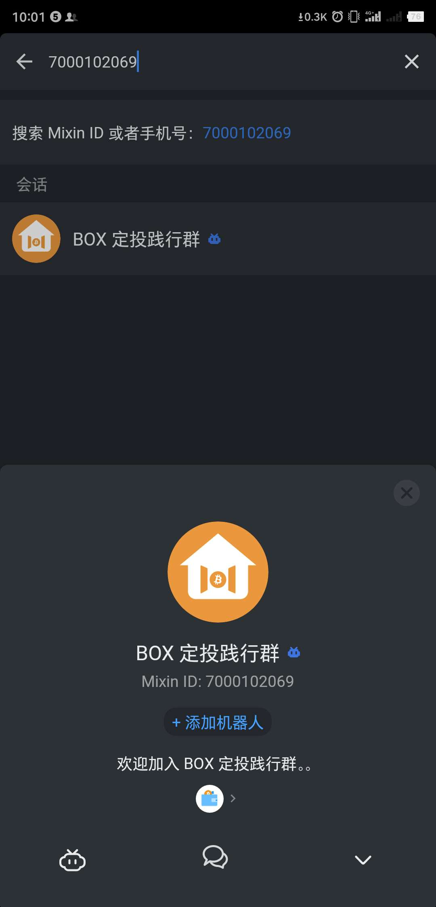
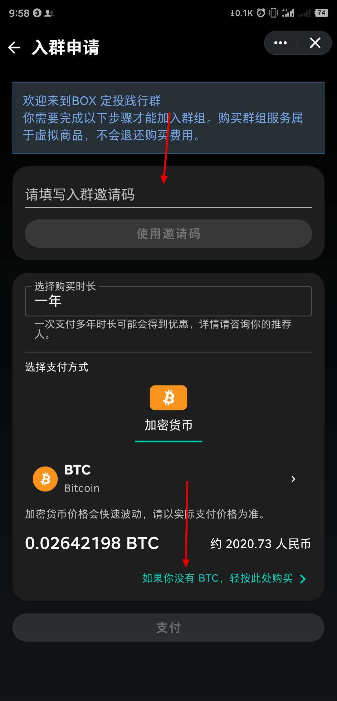
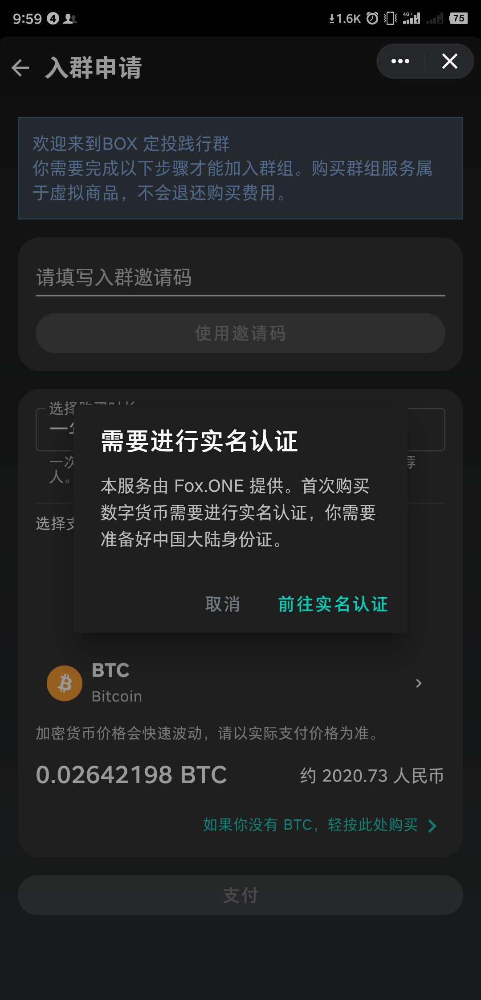

# 为什么普通人错过“定投践行群”的损失可能无限大？

## 定投践行群是什么？

2019年8月19日，德成加入了李笑来老师的“BOX定投践行群”，可以这么说，德成已经不再是以前那个德成了,你现在从这个网页了解到德成，这一点就说明了德成的变化，德成以前哪会用GitHub啊，哪懂投资啊，哪懂投资比特币啊。李笑来老师组建的这个“BOX定投践行群”，当然它不是一个单纯的群，与之配套的，有对应的一本书《定投改变命运》，纸质版书叫《让时间陪你慢慢变富》，于2019年12月出版。

《定投改变命运》中有一个观点：“定投改变命运”不仅可以改变个人的命运，甚至能改变整个家族的命运。

读完《定投改变命运》能让你知道定投策略是简单粗暴有效的。然而，遗憾的是很少有人能确实做到定投策略，**知道和做到之间的距离是很远很远的，而加入BOX定投践行群可以最大程度确保做到**。

BOX定投践行群，作用之一就是用来帮助读者践行书里面的策略。毫不夸张地说，定投策略碾压市面上一切的所谓行情分析、K线分析等花式策略。然而还不够，你还会发现定投策略不仅适用于投资领域，还适用于工作、学习、生活的方方面面。

学习新技能是定投，健身锻炼是定投……万事都有“灰暗”和“高光”时刻，重要的是要在"灰暗"时刻持续集聚能量。

在群里，你知道有一群人（目前四千多人且在不断变多）和自己一样在践行定投策略，你才不会觉得孤单，且时刻被提醒定投策略是绝对正确的，且一定要践行，只有做了才算数。

* 在群里，“做到”简直就是自然而然的，不做反而浑身难受。

* 在群外，“不做”真是再正常不过了。

群的作用之一是让你切实做到，除此之外，李笑来老师还会在群里为大家提供“笑来定投课堂”，除了笑来老师自己会经常讲课（主要是投资教育），还请来各界“高人”讲各种**提升赚钱能力等级的课程**，注意这里用了“等级”这个词，这种提升不是简单的提升，提升的是“等级”（不太喜欢用“等级”这个词，但暂时没想到其他更合适的词）。

提升赚钱能力等级的课程有：

* 笑来老师的投资心理建设
* 新东方Liuda老师反复讲的逻辑课（主要讲笑来老师的逻辑启蒙书《Beyond Feelings》）
* 中英文都超好的John Gordon老师的英语课
* 汶川地震中走出来的阳光女孩廖智的幸福力分享
* 李俊老师的零基础python编程课
* 王珊的读懂财报课
* ……等等

别被这些课程吓到，你不一定都需要学习，但从这些课程，可以看出笑来老师安排这些课是基于长期主义。

别以为这些技能和自己无关，半年前德成就这么以为，可是，**一旦开始学了，就根本停不下来了，才发现以前的自己都错过了些什么**。

## 普通人错过践行群将错过什么？

* **将错失**一个改变自己甚至整个家族命运的机会

* **将错过**一个最有效的提升赚钱能力的机会

* **将错过**一次将自己的财富放大很多倍的机会

* **将错过**一个提升幸福力的机会

* **将错过**一次和很多人(目前近四千人)一起真正做到的机会

* **将错过**地球上第一个链上区块链ETF交易所的股份

* **将可能错过**抓住整个区块链发展红利的机会

真不是贩卖焦虑，焦虑是一直存在的东西，**可怕的是焦虑过，却改变不了什么**。而定投践行群就是专为改变而生的。

《定投改变命运》这本书不仅适用于现在，**甚至30年后也不过时**。所以无论什么时候加入定投践行群，都不晚。

进群前后会有什么变化呢？

德成学习新技能新知识时心态的变化：

* 以前对自己很没耐心，获得零的突破满足感后，往往就荒废了；

* 现在对自己更有耐心，会付出持续行动，而不是在“灰暗”时段走向荒废。

在投资交易方面,德成亲身经历的变化总结如下图：

现在的德成，无论是暴涨还是爆跌，都高兴。

# 定投践行群入群步骤

## 1.下载安装学习平台

安装 Mixin Messenger 或 新生大讲堂APP(早期叫学习APP)，为什么两者都行？因为这是开源软件，功能基本相同，只是由不同的团队运营。

### Mixin Messenger

（已经安装过就跳过，到下一步）

下载方式：

> + iOS
>  *  国内用户，在 iTunes 下载 Mixin 畅聊版
   >> iOS 国内用户下载的 Mixin 畅聊版 需要添加小钱包机器人（ID: 7000101425）才能使用数字资产收发存储功能。
>  *  国外用户，在 iTunes 下载 Mixin

> + Android
>  * 国内用户，在腾讯应用宝下载，或者小米、锤子应用商店
   >> 或者使用这个链接下载：https://download.exin.one/#/
>  * 国外用户，在 Google Play Store 下载

### 新生大讲堂APP(学习APP)

使用浏览器打开<https://www.firesbox.com/app/>

## 找到BOX定投践行群入口

注册安装 Mixin Messenger 或 学习APP 后，在首页顶端的搜索框搜索【BOX定投践行群】的ID：**7000102069**

点击下方的“+添加机器人”，再点击左下角的机器人小图标。

输入邀请码：**784M4IBZM8**，接着点击右侧的“使用邀请码”。

如果你的 Mixin 钱包的 BTC 余额不足，可以点击下方的“轻按此处购买”

第一次购买需要完成实名认证，按指引即可完成。

如果暂时不想实名认证，可以点击[ExinOne专属通道](https://exinone.com/p/784M4IBZM8)注册购买BTC，可无需实名认证购买门票所需的BTC。

购买2030人民币以上的BTC（价格会浮动，为了避免不够，稍多买点，比如2100元）

输入邀请码，支付2020.73人民币等值的BTC，就成功进群了，恭喜你进入了一个新世界！

## 2.关于入群邀请码

德成是BOX定投践行群资深成员，拥有践行群门票的销售权，也就是邀请码，添加德成微信：cdckql，也可以 Mixin Messenger 里直接联系德成，Mixin ID: 37163725。入群前有任何疑问，德成都可以为你解答，入群后我们就是一起践行的战友了，我们一起学习升级，一起越来越富。

> * 邀请码绑定了“BOX定投践行群门票”与“笑来定投课堂”的一手销售权。践行群内的成员每定投200USDT的BOX，就可以申请3个邀请码。
> * 成功将门票与课堂销售一次，可以获得售价（2020.73人民币等值的BTC，每年递增1元）约25%的销售奖励，也就是500人民币等值的BTC，这是定投践行群提供给合格践行者的收入渠道之一,你购买门票入群后也能获得一手销售权。
> * 践行群2019-2020第一年，邀请码是有限的，成员每定投200美元的 BOX 才能获得3个邀请码。践行群经过一年的成功验证后，于2020年8月开放了永久邀请码，这是德成的：**784M4IBZM8**

使用德成提供的邀请码入群，如果你需要德成的相关技能为你解决某些问题，**可以免费加入德成的收费服务圈子“有事儿找德成”**，Mixin ID:7000102622。

找德成能干嘛？

> * 提供在Mixin赚BTC的帮助与服务。

> * 如果你目前单身，遇到了心仪的异性，却不知如何才能让彼此相爱，巧了，德成可以提供有效帮助。

> * 其他你可能遇到的问题。

